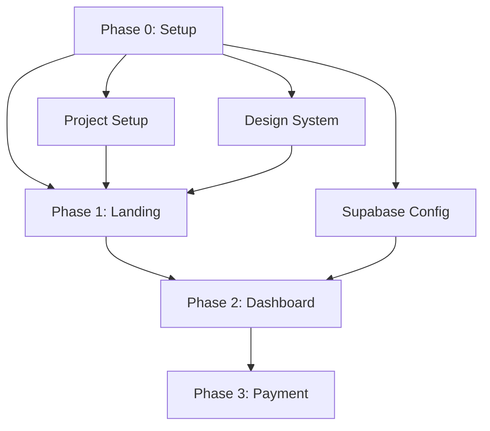

# 🚀 Formelio - Système de Gestion des Tasks

Ce repository contient l'infrastructure complète de gestion des tasks pour le projet Formelio, optimisée pour l'intégration avec les Model Context Protocol (MCP) servers et GitHub.

## 📦 Contenu

```
.
├── tasks/                          # Tasks structurées par phase
│   ├── README.md                   # Master task list
│   ├── common/                     # Phase 0: Setup
│   │   ├── 01-project-setup.md
│   │   └── 02-design-system.md
│   ├── phase1-landing/             # Phase 1: Landing page
│   │   └── 02-homepage-hero.md
│   ├── phase2-dashboard/           # Phase 2: Dashboard & Auth
│   │   └── 01-auth-system.md
│   └── phase3-payment/             # Phase 3: Payment
│       └── (à créer)
├── scripts/                        # Scripts d'automatisation
│   └── generate-github-issues.js   # Génération issues GitHub
├── cahier_des_charges_formelio.md  # Cahier des charges complet
├── MCP_WORKFLOW.md                 # Configuration workflow MCP
├── package.json                    # NPM scripts
└── .env.example                    # Variables d'environnement
```

## 🎯 Vue d'ensemble

### Approche en 3 phases

Le projet Formelio est structuré en **3 phases** avec un **setup initial** (Phase 0) :

| Phase | Nom | Durée | Tasks | Effort |
|-------|-----|-------|-------|--------|
| **Phase 0** | Setup & Config | 3-5 jours | 3 | 13h |
| **Phase 1** | Landing Page | 3-4 semaines | 8 | 41h |
| **Phase 2** | Dashboard & Auth | 4-6 semaines | 12 | 98h |
| **Phase 3** | Payment & Billing | 2-3 semaines | 7 | 48h |
| **Total** | - | **10-14 semaines** | **30** | **200h** |

### Stack technique

- **Frontend** : Next.js 14 (App Router) + Tailwind CSS + Shadcn UI
- **Backend** : Supabase (Auth, Database, Storage, Realtime)
- **Payment** : Stripe
- **Deployment** : Vercel
- **Boilerplate** : Next-SaaS-Stripe-Starter

### 📚 SaaS Architecture References

Projets open-source et boilerplates de référence pour l'architecture Formelio :

| Ressource | Description | Lien |
|-----------|-------------|------|
| **Dub.co** | SaaS open-source Next.js 15 + Supabase, architecture propre, API REST & Edge, RLS exemplaire | [github.com/dubinc/dub](https://github.com/dubinc/dub) |
| **Cal.com** | SaaS complexe Next.js : multi-tenant, API REST + GraphQL, Stripe, Supabase | [github.com/calcom/cal.com](https://github.com/calcom/cal.com) |
| **Supastarter** | Boilerplate pro Supabase + Next.js + Tailwind + Stripe + tests | [supastarter.dev](https://supastarter.dev) |
| **IndieHackers SaaS** | Retour d'expérience construction SaaS Supabase/Next.js | [indiehackers.com/post/i-built-a-saas-boilerplate...](https://www.indiehackers.com/post/i-built-a-saas-boilerplate-for-nextjs-and-supabase-ad798d3133) |
| **Nhost Boilerplate** | Alternative Supabase, bonne organisation code multi-services | [github.com/nhost/nhost-nextjs-boilerplate](https://github.com/nhost/nhost-nextjs-boilerplate) |

**Utilité** : Ces projets sont d'excellentes références pour l'organisation du code, les patterns d'architecture, et les best practices SaaS.

---

## 🚀 Quick Start

### 1. Installation

```bash
# Cloner le repository
git clone https://github.com/your-org/formelio.git
cd formelio

# Installer les dépendances
npm install

# Configurer les variables d'environnement
cp .env.example .env.local
# Éditer .env.local avec vos credentials
```

### 2. Configuration GitHub

```bash
# Installer GitHub CLI
brew install gh  # macOS
# ou: https://cli.github.com/

# Authentification
gh auth login

# Configurer les variables
export GITHUB_REPO_OWNER=your-org
export GITHUB_REPO_NAME=formelio
```

### 3. Générer les issues GitHub

```bash
# Dry run (test sans créer d'issues)
npm run generate:issues:dry

# Générer toutes les issues
npm run generate:issues

# Ou phase par phase
npm run generate:issues:phase1
npm run generate:issues:phase2
npm run generate:issues:phase3
```

---

## 📋 Structure des Tasks

Chaque task suit un template standardisé avec :

### Métadonnées
- **ID** : Identifiant unique (ex: P1-02)
- **Phase** : 0-3
- **Priority** : P0 (critique) → P3 (low)
- **Effort** : Estimation en heures
- **Status** : TODO, IN PROGRESS, DONE, BLOCKED

### Contenu structuré
- **Description** : Contexte et objectifs
- **Acceptance Criteria** : Checklist de validation
- **Technical Implementation** : Code snippets, architecture
- **Dependencies** : Pré-requis et tâches bloquées
- **Testing** : Stratégie de test
- **Resources** : Documentation et références

### Exemple

```markdown
# P1-02 - Homepage Hero & Value Proposition

**ID** : P1-02
**Phase** : 1 (Landing Page)
**Priority** : P0 (Critique)
**Effort** : 8 heures
**Status** : 🔴 TODO

## 📋 Description
Créer la section Hero de la page d'accueil...

## ✅ Acceptance Criteria
- [ ] Hero section responsive
- [ ] Logo Formelio affiché
- [ ] CTA principal fonctionnel

## 🔧 Technical Implementation
```tsx
export function HeroSection() {
  // Implementation
}
```
...
```

---

## 🔄 Workflow MCP

Le système est conçu pour s'intégrer avec les **Model Context Protocol servers** :

### 1. Context7 → Analyse & Génération

```
@context7 analyze cahier_des_charges_formelio.md
@context7 generate-tasks --phase 1 --output ./tasks/phase1-landing/
```

### 2. Filesystem → Sauvegarde locale

```
@filesystem write ./tasks/phase1-landing/03-about-page.md
@filesystem watch ./tasks/ --on-change trigger-review
```

### 3. GitHub MCP → Création des issues

```
@github create-issues --from ./tasks/ --dry-run
@github create-issues --from ./tasks/phase1-landing/ --milestone "Phase 1"
```

### 4. TaskFlow → Organisation en sprints

```
@taskflow create-sprint --name "Sprint 1" --duration 2w
@taskflow assign-to-sprint --issues P1-01,P1-02 --sprint 1
```

👉 **Voir [MCP_WORKFLOW.md](MCP_WORKFLOW.md) pour la documentation complète**

---

## 🛠️ Scripts disponibles

| Script | Description |
|--------|-------------|
| `npm run generate:issues` | Génère toutes les issues GitHub |
| `npm run generate:issues:dry` | Test sans créer d'issues |
| `npm run generate:issues:phase1` | Issues Phase 1 uniquement |
| `npm run task:list` | Liste toutes les tasks |
| `npm run task:status` | Affiche le statut global |
| `npm run validate:tasks` | Valide le format des tasks |
| `npm run format:tasks` | Formate les fichiers markdown |

---

## 📊 Visualisation du progrès

### Structure de dépendances



### Board Kanban (GitHub Projects)

Les issues créées peuvent être organisées dans un board GitHub Projects :

| Backlog | Ready | In Progress | Review | Done |
|---------|-------|-------------|--------|------|
| P2-05 | P1-01 | P1-02 | P1-03 | COMMON-01 |
| P2-06 | P1-04 | | | COMMON-02 |

---

## ✅ Checklist de validation

### Phase 0 - Setup
- [ ] Project setup completed
- [ ] Design system configured
- [ ] Supabase project created
- [ ] First deployment successful

### Phase 1 - Landing Page
- [ ] Homepage Hero implemented
- [ ] All sections completed
- [ ] Legal pages published
- [ ] SEO optimized (PageSpeed > 80)

### Phase 2 - Dashboard
- [ ] Authentication working
- [ ] Dashboard accessible
- [ ] Document upload functional
- [ ] Chat system operational

### Phase 3 - Payment
- [ ] Stripe integration complete
- [ ] Invoice generation working
- [ ] Transaction history available

---

## 🎯 Priorités

### Légende des priorités

- **P0** 🔴 : **Critique** - Bloquant pour le MVP
- **P1** 🟠 : **Haute** - Important pour l'expérience utilisateur
- **P2** 🟡 : **Moyenne** - Nice-to-have
- **P3** ⚪ : **Basse** - Future enhancements

### Distribution actuelle

| Priority | Count | % |
|----------|-------|---|
| P0 | 15 | 50% |
| P1 | 10 | 33% |
| P2 | 5 | 17% |

---

## 📈 Métriques de projet

### Effort total : **200 heures**

Avec une équipe de 2 développeurs à temps plein :
- **Capacité par sprint** : 80h (2 devs × 40h)
- **Nombre de sprints** : ~2.5 sprints
- **Durée estimée** : 5-6 semaines

### Velocity tracking

| Sprint | Prévu | Réalisé | Velocity |
|--------|-------|---------|----------|
| Sprint 1 | 13h | - | - |
| Sprint 2 | 40h | - | - |
| Sprint 3 | 40h | - | - |

---

## 🔒 Sécurité & Conformité

### RGPD

⚠️ **CRITIQUE** : Formelio traite des données juridiques sensibles

- [ ] Consentement explicite implémenté
- [ ] Politique de confidentialité publiée
- [ ] Droit à l'effacement fonctionnel
- [ ] Hébergement en Europe (Supabase EU)
- [ ] Chiffrement des documents au repos

### Sécurité

- [ ] HTTPS obligatoire
- [ ] Row Level Security (RLS) activée
- [ ] Authentication JWT sécurisée
- [ ] Rate limiting configuré
- [ ] Audit logs en place

---

## 📞 Support & Contact

### Questions techniques
- **Tech Lead** : [tech-lead@formelio.fr]
- **Documentation** : [/docs](./docs)
- **Issues GitHub** : [github.com/formelio/project/issues](https://github.com)

### Ressources
- [Cahier des charges complet](./cahier_des_charges_formelio.md)
- [Configuration MCP](./MCP_WORKFLOW.md)
- [Next.js Documentation](https://nextjs.org/docs)
- [Supabase Docs](https://supabase.com/docs)

---

## 🎨 Design System

### Fonts
- **Headings** : Poppins (Bold, SemiBold)
- **Body** : Inter (Regular, Medium)

### Colors
- **Primary** : #2E5F7E (Bleu Formelio)
- **Secondary** : #4A90B5 (Bleu clair)
- **Accent** : #F59E0B (Orange - CTA)
- **Success** : #10B981
- **Error** : #EF4444

### Components (Shadcn UI)
- Button, Card, Form, Input
- Badge (statuts des dossiers)
- Dialog, Alert, Toast
- Dropdown, Tabs, Avatar

---

## 📄 License

MIT License - © 2025 Formelio

---

## 🌟 Next Steps

1. **Valider le cahier des charges** : Review et ajustements
2. **Setup du projet** : Suivre Phase 0
3. **Générer les issues** : `npm run generate:issues`
4. **Planifier Sprint 1** : Setup + début landing page
5. **Commencer le développement** : Task COMMON-01

---

**Version** : 1.0  
**Dernière mise à jour** : Octobre 2025  
**Statut** : ✅ Ready for development

---

💙 **Formelio** - Votre temps, notre priorité
