# MCP Workflow Configuration

Ce fichier définit le workflow d'intégration avec les Model Context Protocol (MCP) servers pour automatiser la gestion des tasks et l'intégration avec GitHub.

## 🔄 Workflow Overview

```mermaid
graph TD
    A[Cahier des charges] --> B[Context7 MCP]
    B --> C[Génération tasks structurées]
    C --> D[Sauvegarde /tasks/]
    D --> E{Review humain}
    E -->|Validé| F[Git commit]
    E -->|Modifications| C
    F --> G[GitHub MCP]
    G --> H[Création issues GitHub]
    H --> I[Project/TaskFlow MCP]
    I --> J[Organisation sprints/milestones]
```



## ⚙️ Configuration des MCP Servers

### 1. Context7 (Analyse & Génération)

**Purpose**: Analyse le cahier des charges et génère les tasks hiérarchisées

**Configuration** (`~/.config/claude/context7.json`):
```json
{
  "server": "context7",
  "enabled": true,
  "config": {
    "documents_path": "./project-docs",
    "tasks_output_path": "./tasks",
    "task_template": "detailed",
    "auto_dependencies": true,
    "estimation_method": "planning_poker"
  }
}
```

**Usage**:
```
@context7 analyze cahier_des_charges_formelio.md
@context7 generate-tasks --phase 1 --output ./tasks/phase1-landing/
```

### 2. Filesystem (Sauvegarde locale)

**Purpose**: Gère la lecture/écriture des fichiers de tasks

**Configuration** (`~/.config/claude/filesystem.json`):
```json
{
  "server": "filesystem",
  "enabled": true,
  "config": {
    "root_path": "./",
    "allowed_paths": [
      "./tasks/**/*.md",
      "./docs/**/*",
      "./scripts/**/*"
    ],
    "watch_changes": true
  }
}
```

**Usage**:
```
@filesystem write ./tasks/phase1-landing/03-about-page.md [content]
@filesystem read ./tasks/README.md
@filesystem watch ./tasks/ --on-change trigger-review
```

### 3. GitHub (Intégration Issues & PRs)

**Purpose**: Crée et gère les issues GitHub à partir des tasks

**Configuration** (`~/.config/claude/github.json`):
```json
{
  "server": "github",
  "enabled": true,
  "config": {
    "owner": "your-org",
    "repo": "formelio",
    "auth_token_env": "GITHUB_TOKEN",
    "auto_labels": true,
    "auto_milestones": true,
    "issue_template": "task",
    "pr_template": "feature"
  }
}
```

**Usage**:
```
@github create-issues --from ./tasks/ --dry-run
@github create-issues --from ./tasks/phase1-landing/ --milestone "Phase 1"
@github update-issue [issue-number] --status "In Progress"
```

### 4. Project/TaskFlow (Organisation)

**Purpose**: Organise les issues en sprints, milestones et manage le backlog

**Configuration** (`~/.config/claude/taskflow.json`):
```json
{
  "server": "taskflow",
  "enabled": true,
  "config": {
    "project_id": "formelio",
    "sprint_duration": "2w",
    "velocity_tracking": true,
    "auto_assign": false,
    "workflow_states": [
      "Backlog",
      "Ready",
      "In Progress",
      "Review",
      "Testing",
      "Done"
    ]
  }
}
```

**Usage**:
```
@taskflow create-sprint --name "Sprint 1" --duration 2w --start-date 2025-11-01
@taskflow assign-to-sprint --issues P1-01,P1-02,P1-03 --sprint 1
@taskflow set-priority --issue P1-02 --priority P0
@taskflow generate-burndown --sprint current
```

---

## 📋 Étapes du Workflow

### Phase 1: Analyse & Génération

```bash
# 1. Analyse du cahier des charges
@context7 analyze ./cahier_des_charges_formelio.md --output-format structured

# 2. Génération des tasks
@context7 generate-tasks \
  --source ./cahier_des_charges_formelio.md \
  --output ./tasks/ \
  --phases 0,1,2,3 \
  --template detailed

# 3. Vérification de la structure
@filesystem list ./tasks/ --recursive --format tree
```

### Phase 2: Review & Validation

```bash
# 1. Review humain des tasks générées
# Ouvrir et valider chaque fichier .md dans /tasks/

# 2. Ajustements si nécessaire
@filesystem edit ./tasks/phase1-landing/02-homepage-hero.md
# Modifier les acceptance criteria, effort, etc.

# 3. Commit des tasks validées
git add tasks/
git commit -m "feat: add structured tasks for all phases"
git push origin main
```

### Phase 3: Création des Issues GitHub

```bash
# 1. Dry run pour vérifier
@github create-issues \
  --from ./tasks/ \
  --dry-run \
  --log ./scripts/github-issues-preview.log

# 2. Créer les issues pour Phase 0 et 1 (priorité haute)
@github create-issues \
  --from ./tasks/common/ \
  --from ./tasks/phase1-landing/ \
  --milestone "MVP Launch" \
  --auto-labels

# 3. Vérifier les issues créées
@github list-issues --milestone "MVP Launch" --format table
```

### Phase 4: Organisation en Sprints

```bash
# 1. Créer les sprints
@taskflow create-sprint --name "Sprint 1: Setup" --duration 1w
@taskflow create-sprint --name "Sprint 2-3: Landing Page" --duration 2w

# 2. Assigner les tasks aux sprints
@taskflow assign-to-sprint \
  --issues COMMON-01,COMMON-02,COMMON-03 \
  --sprint 1

@taskflow assign-to-sprint \
  --issues P1-01,P1-02,P1-03,P1-04 \
  --sprint 2

# 3. Définir les priorités
@taskflow set-priority --issues COMMON-* --priority P0
@taskflow set-priority --issues P1-02,P1-05 --priority P0

# 4. Générer le board Kanban
@taskflow generate-board --sprint current --format github-projects
```

---

## 🤖 Automatisation avec CI/CD

### GitHub Actions Workflow

**.github/workflows/tasks-sync.yml**:
```yaml
name: Tasks Sync

on:
  push:
    paths:
      - 'tasks/**/*.md'
  workflow_dispatch:

jobs:
  sync-issues:
    runs-on: ubuntu-latest
    steps:
      - uses: actions/checkout@v3
      
      - name: Setup Node.js
        uses: actions/setup-node@v3
        with:
          node-version: '18'
      
      - name: Install GitHub CLI
        run: |
          curl -fsSL https://cli.github.com/packages/githubcli-archive-keyring.gpg | sudo dd of=/usr/share/keyrings/githubcli-archive-keyring.gpg
          sudo apt update
          sudo apt install gh
      
      - name: Authenticate GitHub CLI
        run: echo "${{ secrets.GITHUB_TOKEN }}" | gh auth login --with-token
      
      - name: Generate GitHub Issues
        env:
          GITHUB_REPO_OWNER: ${{ github.repository_owner }}
          GITHUB_REPO_NAME: ${{ github.event.repository.name }}
        run: node scripts/generate-github-issues.js
      
      - name: Update Project Board
        run: |
          # Script custom pour update le board
          node scripts/update-project-board.js
```

---

## 📊 Templates de Tasks

### Template Standard

Tous les fichiers de tasks suivent ce format:

```markdown
# [TASK_ID] - [Task Title]

**ID** : [TASK_ID]
**Phase** : [0-3]
**Priority** : [P0-P3]
**Effort** : [X heures]
**Status** : 🔴 TODO

---

## 📋 Description
[Description détaillée de la task]

## 🎯 Objectifs
1. Objectif 1
2. Objectif 2

## ✅ Acceptance Criteria
- [ ] Critère 1
- [ ] Critère 2

## 🔧 Technical Implementation
[Code snippets, architecture, etc.]

## 🔗 Dependencies
### Prerequisite
- [Dependencies]

### Bloquant pour
- [Blocked tasks]

## 🧪 Testing
[Test strategy]

## 📚 Resources
[Links and references]

## ⚠️ Potential Issues
[Known risks]

## 👤 Assignee
[Team member]

## 🏁 Completion Checklist
- [ ] Item 1
- [ ] Item 2
```

---

## 🔧 Scripts Utilitaires

### Génération d'issues GitHub
```bash
# Générer toutes les issues
npm run generate:issues

# Dry run
DRY_RUN=true npm run generate:issues

# Générer seulement Phase 1
npm run generate:issues:phase1
```

### Mise à jour du statut
```bash
# Update task status
npm run task:update P1-02 --status "In Progress"

# Sync avec GitHub
npm run task:sync
```

### Génération de rapports
```bash
# Sprint burndown
npm run report:burndown --sprint current

# Velocity chart
npm run report:velocity --sprints 1,2,3

# Progress dashboard
npm run report:progress --phase 1
```

---

## 🎯 Best Practices

### 1. Review Process
- Toujours review les tasks générées avant commit
- Valider les estimations d'effort
- Vérifier les dépendances

### 2. Issue Management
- Créer les issues phase par phase
- Ne pas créer toutes les issues d'un coup
- Update le statut régulièrement

### 3. Sprint Planning
- Sprint duration: 1-2 semaines
- Capacité: ~40h par dev par sprint
- Buffer: 20% pour imprévus

### 4. Dependencies
- Toujours lister les dependencies
- Blocker les issues non-ready
- Communiquer les blocages

---

## 📞 Support

**Questions sur le workflow MCP** : [tech-lead@formelio.fr]  
**Issues GitHub** : [github.com/formelio/project/issues]  
**Documentation** : [/docs/mcp-workflow.md]

---

**Version** : 1.0  
**Last updated** : Octobre 2025
